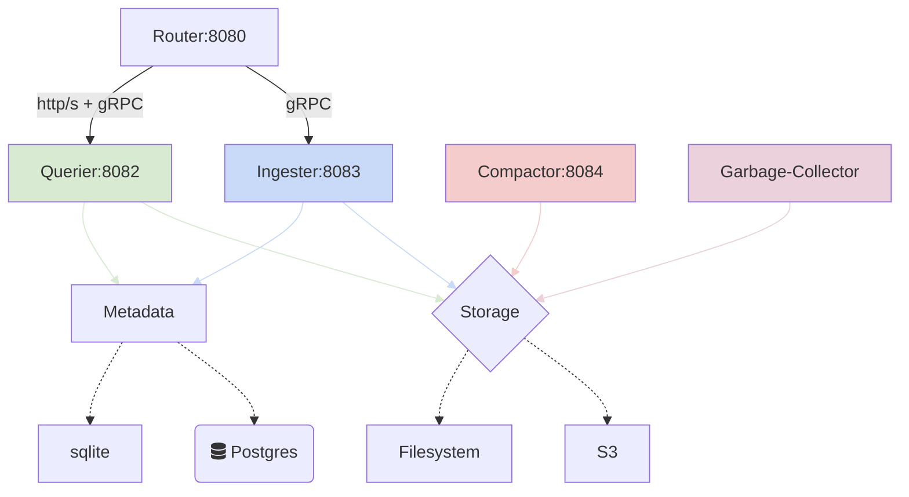

# InfluxDB 3.x "IOx" Community
Community Builds and Containers for InfluxDB 3.0 IOx _(eye-ox)_

### Motivation
😄 You want to try and experiment with IOx low-cost storage, unlimited cardinality and flight sql<br>
🥵‍ The IOx project is in _"Cloud Only"_ mode and InfluxDB is not producing builds yet...<br>
😄 No problem! Meet the _unofficial_ InfluxDB 3.0 _"IOx"_ musl + docker builder for early adopters

#### Nightly Builds
###### amd64/musl
  - [x] [docker](https://github.com/metrico/iox-community/pkgs/container/iox-musl): `docker pull ghcr.io/metrico/iox-musl:latest`
  - [x] [binary](https://github.com/metrico/iox-community/releases): `github.com/metrico/iox-community/releases/latest/download/influxdb_iox`

<br>

## Preparation

Before proceeding further, familiarize with the [IOx/InfluxDB 3.0 design concepts and components](https://www.influxdata.com/blog/influxdb-3-0-system-architecture/)

<!--  -->


<br>

## Get Started

This guide uses Docker and docker-compose. You can run locally using a [static build](https://github.com/metrico/iox-community/releases).

#### Static
```bash
curl -fsSL github.com/metrico/iox-builder/releases/latest/download/influxdb_iox -O \
&& chmod +x influxdb_iox
```

#### Docker

The default compose uses local filesystem. Use the full recipe for Object Storage and Postgres Catalog.

```
docker-compose up -f docker-compose.yml -d
```

Your local IOx endpoint should be ready on port `8086`

#### Health

Check the instance health: 
```
curl http://127.0.0.1:8086/health
```

The expected response is `OK`


<br>
  
<details>
    <summary><h2>IOx Settings</h2> Deploy IOx using different settings</summary>  
  
This demo will launch IOx `router`, `querier`, `ingester` and `compactor` on the same host using local storage:

Each service uses a dedicated port for scaling and distribution. In this demo, nginx will proxy traffic between services.
  
<br>  

```
      - INFLUXDB_IOX_OBJECT_STORE=file
      - INFLUXDB_IOX_DB_DIR=/data
      - INFLUXDB_IOX_BUCKET=iox
      - INFLUXDB_IOX_CATALOG_DSN=sqlite:///data/catalog.sqlite
      - INFLUXDB_IOX_ROUTER_HTTP_BIND_ADDR=iox:8080
      - INFLUXDB_IOX_ROUTER_GRPC_BIND_ADDR=iox:8081
      - INFLUXDB_IOX_QUERIER_GRPC_BIND_ADDR=iox:8082
      - INFLUXDB_IOX_INGESTER_GRPC_BIND_ADDR=iox:8083
      - INFLUXDB_IOX_COMPACTOR_GRPC_BIND_ADDR=iox:8084
```

Each server needs an identifier for writing to object storage and as an identifier that is added to replicated writes, Write Buffer segments and Chunks. Must be unique in a group of connected or semi-connected IOx servers. Must be a number that can be represented by a 32-bit unsigned integer.

```
      - INFLUXDB_IOX_ID=1
```


The demo catalog uses *sqlite* by default. To enable persistent catalog using *postgres*, use the following:

```
      - INFLUXDB_IOX_CATALOG_DSN=postgres://postgres@localhost:5432/postgres
```

The demo stores to filesystem. To enable S3/R2/Minio object storage use the following parameters:

```
      - INFLUXDB_IOX_OBJECT_STORE=s3
      - AWS_ACCESS_KEY_ID=access_key_value
      - AWS_SECRET_ACCESS_KEY=secret_access_key_value
      - AWS_DEFAULT_REGION=us-east-2
      - INFLUXDB_IOX_BUCKET=bucket-name
      - AWS_ENDPOINT = http://minio:9000
```

For other storage options refer to [env example](https://github.com/metrico/iox-builder/blob/main/env.example)

### API Proxy

To emulate InfluxDB3.0 Cloud works, an nginx proxy is included to serve all IOx services from a single endpoint.
```
events {}
http {
  server {
    listen 8086;
    http2 on;
    location /api {
       proxy_pass_request_headers on;
       proxy_pass http://iox:8080;
    }
    location /health {
       proxy_pass http://iox:8080;
    }
    location / {
       proxy_pass_request_headers on;
       if ($http_content_type = "application/grpc") {
            grpc_pass iox:8082;
       }
       proxy_pass http://iox:8082;
    }
  }
}
```


</details>
  

<details open=true>
    <summary><h2>IOX Insert & Query</h2> Validate your IOx Setup</summary>

<br>

Let's start testing and using your brand new IOx instance!  
  

### Line Protocol Examples

Our goal is observability formats ingestion into IOx. Here are some scope examples:

#### Metrics
```
avalanche_metric_mmmmm_0_71 cycle_id="0",gauge=29,host.name="generate-metrics-avalanche",label_key_kkkkk_0="label_val_vvvvv_0",label_key_kkkkk_1="label_val_vvvvv_1",label_key_kkkkk_2="label_val_vvvvv_2",label_key_kkkkk_3="label_val_vvvvv_3",label_key_kkkkk_4="label_val_vvvvv_4",label_key_kkkkk_5="label_val_vvvvv_5",label_key_kkkkk_6="label_val_vvvvv_6",label_key_kkkkk_7="label_val_vvvvv_7",label_key_kkkkk_8="label_val_vvvvv_8",label_key_kkkkk_9="label_val_vvvvv_9",port="9090",scheme="http",series_id="3",service.name="otel-collector" 1613772311130000000
avalanche_metric_mmmmm_0_71 cycle_id="0",gauge=16,host.name="generate-metrics-avalanche",label_key_kkkkk_0="label_val_vvvvv_0",label_key_kkkkk_1="label_val_vvvvv_1",label_key_kkkkk_2="label_val_vvvvv_2",label_key_kkkkk_3="label_val_vvvvv_3",label_key_kkkkk_4="label_val_vvvvv_4",label_key_kkkkk_5="label_val_vvvvv_5",label_key_kkkkk_6="label_val_vvvvv_6",label_key_kkkkk_7="label_val_vvvvv_7",label_key_kkkkk_8="label_val_vvvvv_8",label_key_kkkkk_9="label_val_vvvvv_9",port="9090",scheme="http",series_id="4",service.name="otel-collector" 1613772311130000000
avalanche_metric_mmmmm_0_71 cycle_id="0",gauge=22,host.name="generate-metrics-avalanche",label_key_kkkkk_0="label_val_vvvvv_0",label_key_kkkkk_1="label_val_vvvvv_1",label_key_kkkkk_2="label_val_vvvvv_2",label_key_kkkkk_3="label_val_vvvvv_3",label_key_kkkkk_4="label_val_vvvvv_4",label_key_kkkkk_5="label_val_vvvvv_5",label_key_kkkkk_6="label_val_vvvvv_6",label_key_kkkkk_7="label_val_vvvvv_7",label_key_kkkkk_8="label_val_vvvvv_8",label_key_kkkkk_9="label_val_vvvvv_9",port="9090",scheme="http",series_id="5",service.name="otel-collector" 1613772311130000000
avalanche_metric_mmmmm_0_71 cycle_id="0",gauge=90,host.name="generate-metrics-avalanche",label_key_kkkkk_0="label_val_vvvvv_0",label_key_kkkkk_1="label_val_vvvvv_1",label_key_kkkkk_2="label_val_vvvvv_2",label_key_kkkkk_3="label_val_vvvvv_3",label_key_kkkkk_4="label_val_vvvvv_4",label_key_kkkkk_5="label_val_vvvvv_5",label_key_kkkkk_6="label_val_vvvvv_6",label_key_kkkkk_7="label_val_vvvvv_7",label_key_kkkkk_8="label_val_vvvvv_8",label_key_kkkkk_9="label_val_vvvvv_9",port="9090",scheme="http",series_id="6",service.name="otel-collector" 1613772311130000000
avalanche_metric_mmmmm_0_71 cycle_id="0",gauge=51,host.name="generate-metrics-avalanche",label_key_kkkkk_0="label_val_vvvvv_0",label_key_kkkkk_1="label_val_vvvvv_1",label_key_kkkkk_2="label_val_vvvvv_2",label_key_kkkkk_3="label_val_vvvvv_3",label_key_kkkkk_4="label_val_vvvvv_4",label_key_kkkkk_5="label_val_vvvvv_5",label_key_kkkkk_6="label_val_vvvvv_6",label_key_kkkkk_7="label_val_vvvvv_7",label_key_kkkkk_8="label_val_vvvvv_8",label_key_kkkkk_9="label_val_vvvvv_9",port="9090",scheme="http",series_id="7",service.name="otel-collector" 1613772311130000000
```

#### Logs
```
logs fluent.tag="fluent.info",pid=18i,ppid=9i,worker=0i 1613769568895331700
logs fluent.tag="fluent.debug",instance=1720i,queue_size=0i,stage_size=0i 1613769568895697200
logs fluent.tag="fluent.info",worker=0i 1613769568896515100
```

#### Tracing Spans
```
spans end_time_unix_nano="2021-02-19 20:50:25.6893952 +0000 UTC",instrumentation_library_name="tracegen",kind="SPAN_KIND_INTERNAL",name="okey-dokey",net.peer.ip="1.2.3.4",parent_span_id="d5270e78d85f570f",peer.service="tracegen-client",service.name="tracegen",span.kind="server",span_id="4c28227be6a010e1",status_code="STATUS_CODE_OK",trace_id="7d4854815225332c9834e6dbf85b9380" 1613767825689169000
spans end_time_unix_nano="2021-02-19 20:50:25.6893952 +0000 UTC",instrumentation_library_name="tracegen",kind="SPAN_KIND_INTERNAL",name="lets-go",net.peer.ip="1.2.3.4",peer.service="tracegen-server",service.name="tracegen",span.kind="client",span_id="d5270e78d85f570f",status_code="STATUS_CODE_OK",trace_id="7d4854815225332c9834e6dbf85b9380" 1613767825689135000
spans end_time_unix_nano="2021-02-19 20:50:25.6895667 +0000 UTC",instrumentation_library_name="tracegen",kind="SPAN_KIND_INTERNAL",name="okey-dokey",net.peer.ip="1.2.3.4",parent_span_id="b57e98af78c3399b",peer.service="tracegen-client",service.name="tracegen",span.kind="server",span_id="a0643a156d7f9f7f",status_code="STATUS_CODE_OK",trace_id="fd6b8bb5965e726c94978c644962cdc8" 1613767825689388000
spans end_time_unix_nano="2021-02-19 20:50:25.6895667 +0000 UTC",instrumentation_library_name="tracegen",kind="SPAN_KIND_INTERNAL",name="lets-go",net.peer.ip="1.2.3.4",peer.service="tracegen-server",service.name="tracegen",span.kind="client",span_id="b57e98af78c3399b",status_code="STATUS_CODE_OK",trace_id="fd6b8bb5965e726c94978c644962cdc8" 1613767825689303300
spans end_time_unix_nano="2021-02-19 20:50:25.6896741 +0000 UTC",instrumentation_library_name="tracegen",kind="SPAN_KIND_INTERNAL",name="okey-dokey",net.peer.ip="1.2.3.4",parent_span_id="6a8e6a0edcc1c966",peer.service="tracegen-client",service.name="tracegen",span.kind="server",span_id="d68f7f3b41eb8075",status_code="STATUS_CODE_OK",trace_id="651dadde186b7834c52b13a28fc27bea" 1613767825689480300
```

<br>

### Insert

Insert a sample dataset using the Influx V2 API and line protocol to test the `router` API on port `8080`

#### Metrics
```bash
wget -qO- "https://github.com/influxdata/influxdb_iox/raw/main/test_fixtures/lineproto/metrics.lp" | \
curl -v "http://127.0.0.1:8080/api/v2/write?org=company&bucket=sensors" --data-binary @-
```

#### Logs
```bash
echo 'syslog,appname=myapp,facility=console,host=myhost,hostname=myhost,severity=warning facility_code=14i,message="warning message here",severity_code=4i,procid="12345",timestamp=1434055562000000000,version=1' | \
 curl -v "http://127.0.0.1:8080/api/v2/write?org=company&bucket=logs" --data-binary @-
```

The expected response is `204`

### Query
Let's launch the `sql` client using the `querier` gRPC API on port `8082`

* Using Binary: `./influxdb_iox --host http://localhost:8082 sql`
* Using Docker: `docker run -ti --rm ghcr.io/metrico/iox:latest --host http://iox:8082 sql`

#### [Flight SQL](https://github.com/influxdata/influxdb_iox/blob/main/docs/sql.md)

The first requirement is to choose a namespace _(or bucket)_ from the available ones:
```sql
> show namespaces;
```
```
+--------------+-----------------+
| namespace_id | name            |
+--------------+-----------------+
| 1            | company_sensors |
+--------------+-----------------+

> use company_sensors;
You are now in remote mode, querying namespace company_sensors
```

Once a namespace is selected, we can display any contained tables:
```sql
company_sensors> show tables;
```
```
+---------------+--------------------+-------------+------------+
| table_catalog | table_schema       | table_name  | table_type |
+---------------+--------------------+-------------+------------+
| public        | iox                | cpu         | BASE TABLE |
| public        | iox                | disk        | BASE TABLE |
| public        | iox                | diskio      | BASE TABLE |
| public        | iox                | mem         | BASE TABLE |
| public        | iox                | net         | BASE TABLE |
| public        | iox                | processes   | BASE TABLE |
| public        | iox                | swap        | BASE TABLE |
| public        | iox                | system      | BASE TABLE |
| public        | system             | queries     | BASE TABLE |
| public        | information_schema | tables      | VIEW       |
| public        | information_schema | views       | VIEW       |
| public        | information_schema | columns     | VIEW       |
| public        | information_schema | df_settings | VIEW       |
+---------------+--------------------+-------------+------------+
```

From any of the available tables, we can select data:

```sql
company_sensors> select count(*) from cpu;
```
```
+-----------------+
| COUNT(UInt8(1)) |
+-----------------+
| 248             |
+-----------------+
```

#### Metric Search
```sql
company_sensors> select * from cpu WHERE usage_idle <= 96 limit 1;
```
```
+------+---------------------------------+----------------------+-------------+------------------+-------------------+--------------+-----------+------------+---------------+-------------+-------------------+-------------------+
| cpu  | host                            | time                 | usage_guest | usage_guest_nice | usage_idle        | usage_iowait | usage_irq | usage_nice | usage_softirq | usage_steal | usage_system      | usage_user        |
+------+---------------------------------+----------------------+-------------+------------------+-------------------+--------------+-----------+------------+---------------+-------------+-------------------+-------------------+
| cpu0 | Andrews-MBP.hsd1.ma.comcast.net | 2020-06-11T16:52:00Z | 0.0         | 0.0              | 89.56262425447316 | 0.0          | 0.0       | 0.0        | 0.0           | 0.0         | 5.964214711729622 | 4.473161033797217 |
+------+---------------------------------+----------------------+-------------+------------------+-------------------+--------------+-----------+------------+---------------+-------------+-------------------+-------------------+
```

#### Log Search
##### LIKE
```sql
company_logs> select * from syslog WHERE message LIKE '%here%'
```
```
+---------+----------+---------------+--------+----------+----------------------+--------+----------+---------------+--------------------------------+----------------+---------+
| appname | facility | facility_code | host   | hostname | message              | procid | severity | severity_code | time                           | timestamp      | version |
+---------+----------+---------------+--------+----------+----------------------+--------+----------+---------------+--------------------------------+----------------+---------+
| myapp   | console  | 14            | myhost | myhost   | warning message here | 12345  | warning  | 4             | 2023-06-28T20:30:20.484236503Z | 1.434055562e18 | 1.0     |
+---------+----------+---------------+--------+----------+----------------------+--------+----------+---------------+--------------------------------+----------------+---------+
```
##### Regex
```sql
company_logs> select * from syslog WHERE message ~ '.+here'
```
```
+---------+----------+---------------+--------+----------+----------------------+--------+----------+---------------+--------------------------------+----------------+---------+
| appname | facility | facility_code | host   | hostname | message              | procid | severity | severity_code | time                           | timestamp      | version |
+---------+----------+---------------+--------+----------+----------------------+--------+----------+---------------+--------------------------------+----------------+---------+
| myapp   | console  | 14            | myhost | myhost   | warning message here | 12345  | warning  | 4             | 2023-06-28T20:30:20.484236503Z | 1.434055562e18 | 1.0     |
+---------+----------+---------------+--------+----------+----------------------+--------+----------+---------------+--------------------------------+----------------+---------+
```


</details>
                                                        
<details>
    <summary><h2>IOx Integrations</h2> Integrate your IOx Setup with Go, Rust, Python, etc</summary>  
  
> Official IOx FlightSQL clients:

  * [influxdb3-go](https://github.com/InfluxCommunity/influxdb3-go)
  * [influxdb3-js](https://github.com/InfluxCommunity/influxdb3-js)
  * [influxdb3-python](https://github.com/InfluxCommunity/influxdb3-python)
  * [influxdb3-java](https://github.com/InfluxCommunity/influxdb3-java)
  * [influxdb3-csharp](https://github.com/InfluxCommunity/influxdb3-csharp)

> Generic FlightSQL Drivers
  
  * [iox-community/python](https://github.com/metrico/iox-static-distro/tree/main/examples/python)
  * [iox-community/go](https://github.com/metrico/iox-static-distro/tree/main/examples/go)
  * [iox-community/rust](https://github.com/metrico/iox-static-distro/tree/main/examples/rust)
  * [influxdb-iox-client-go](https://github.com/influxdata/influxdb-iox-client-go)
  * [flightsql-dbapi-python](https://github.com/influxdata/flightsql-dbapi)
  * [influxdb_iox_client-rust](https://crates.io/crates/influxdb_iox_client)

  
<details>
    <summary><h3>Grafana</h3> Integrate your IOx Setup with Grafana</summary>  

  ### Grafana Client

Your service can be used with the [FlightSQL datasource](https://github.com/influxdata/grafana-flightsql-datasource) in Grafana:


Once ready, we can perform queries against our data using the FlightSQL query builder:


                                                        
</details>

</details>

<details>
    <summary><h2>Legal Disclaimers</h2></summary>  
  
- All rights reserved by their respective owners. IOx and InfluxDB are a trademark of Influxdata.   
- This project is not connected or endorsed by Influxdata or the IOx project. Hopefully one day!
- Original, unstable, nightly. The IOx code is not modified in any way as part of the build process. 
  
</details>
